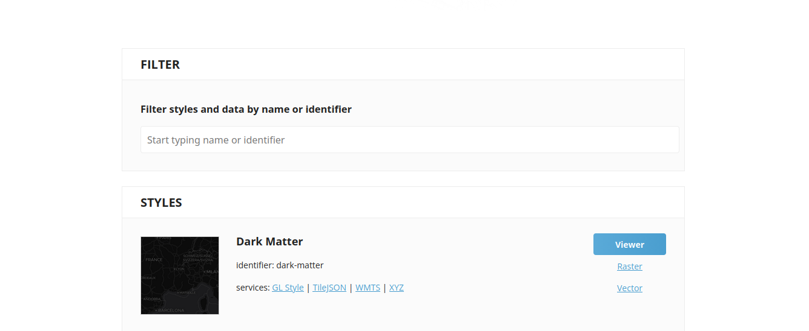
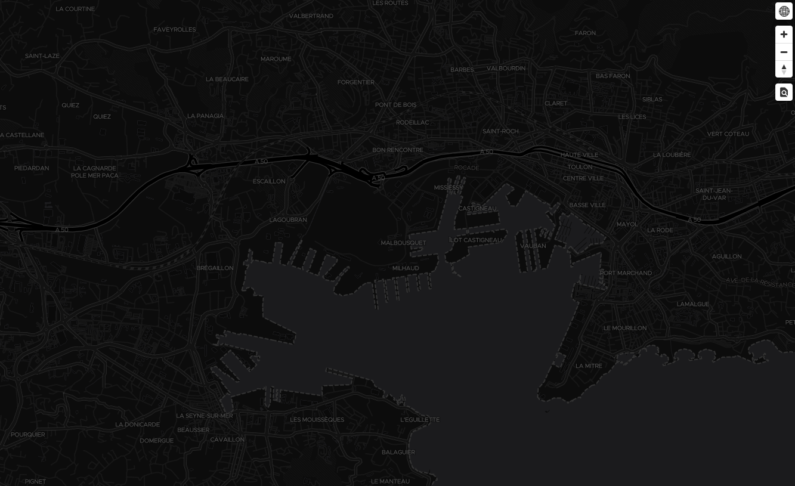

# 🗺️ TileServer GL (Local Setup)

This project is a **fork of TileServer GL**, designed to run locally and serve vector tiles using preconfigured map styles.

## 📦 Free Map Data

TileServer GL uses **MBTiles** datasets that can be freely downloaded from [MapTiler's OSM dataset page](https://www.maptiler.com/on-prem-datasets/dataset/osm/#4.5/42.28/3.94). These datasets are based on OpenStreetMap and provide global coverage.

Once downloaded, place your `.mbtiles` files inside the `mbtiles` directory at the root of the project:

```bash
./mbtiles/your-map-data.mbtiles
```

## 🎨 Available Map Styles

The following map styles are preconfigured and ready to use:

- `dark-matter`: A dark-themed basemap optimized for data visualizations with minimal distractions.
- `fiord-color`: A deep blue basemap inspired by Positron, ideal for elegant data overlays.
- `toner`: A high-contrast black-and-white style designed for clarity and bold visual impact.
- `bright`: A clean and colorful map style that highlights geographic features and points of interest.
- `osm-openmaptiles`: A comprehensive style showcasing all OpenStreetMap features, inspired by the classic OSM Carto design.
- `positron`: A minimalist light basemap with subtle colors, perfect for overlaying custom data layers.
- `voyager`: A richly detailed basemap optimized for mobile and urban navigation, with clear street-level context.


## 🐳 Docker Installation
Before running container make you sure you have the following requirements installed.
### Requirements

- **Docker**: Tested with version 28.5.1

### 1️⃣ Pull the official TileServer GL image

First, build a base image that includes all required libraries.

```bash
docker pull maptiler/tileserver-gl:v5.4.0
```
This version (v5.4.0) has been tested and approved for this setup. You may use the latest tag at your own risk, as newer versions may introduce breaking changes or configuration differences.

### 2️⃣ Run container

Navigate to the root of your project (e.g., cd tileserver_docker) and run the following command:

```bash
docker run --name tileserver --rm -it -v $(pwd):/data -p 8080:8080 maptiler/tileserver-gl:v5.4.0
```
⚠️ Note : In newer versions, the container binds to port 8080 by default.

### 3️⃣ Test the server

Open your browser and go to [http://localhost:8080](http://localhost:8080). You can explore the available map styles and datasets directly from the interface.  

This is the default menu on TileServer :  

  

Click on `Viewer` to test the style and data :  


## 🎨 Adding Custom Styles

To add new styles, add your style files inside the `styles` directory. Make sure each style includes the following key-value pair in its `"sources"` section:

```json
"sources": {
  "openmaptiles": {
    "type": "vector",
    "url": "mbtiles://planet"
  }
}
```
This ensures the style correctly references the MBTiles dataset.  
Next, update the `config.json` file at the root of the project by adding your styles to the `"styles"` section:
```json
"styles": {
  "dark-matter": {
    "style": "styles/dark-matter.json"
  },
  "mon-style": {
    "style": "styles/mon-style.json"
  }
  // Add more styles as needed
}
```
✅ Your custom style is now ready to use!

## 🗂️ Adding New MBTiles Datasets

To add new tile datasets, add your `.mbtiles` files into the `mbtiles` directory.

Then, update the `config.json` file by adding the following lines under the `"data"` section:

```json
"data": {
  "your-dataset-name": {
    "mbtiles": "mbtiles/your-dataset-file.mbtiles"
  }
}
```
To use this new dataset in a style, either modify an existing style or duplicate one, and update the `"sources"` section like this:
```json
"sources": {
  "openmaptiles": {
    "type": "vector",
    "url": "mbtiles://your-dataset-name"
  }
}
```
✅ Your new tileset is now integrated and ready to be displayed !